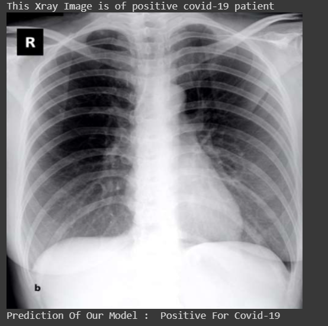

# Covid19-Detection-Using-Chest-X-Ray
Using Convolutional Neural Network, I have implemented a classifier which detects whether the person is infected by Covid-19 or not.

# Dataset
  1) Positive Cases : https://github.com/ieee8023/covid-chestxray-dataset
  2) Normal Cases : https://www.kaggle.com/paultimothymooney/chest-xray-pneumonia

# Network Architecture
    Model: "sequential_1"
    
    Layer (type)                 Output Shape              Param #   
    =================================================================
    conv2d_1 (Conv2D)            (None, 222, 222, 32)      896      
    conv2d_2 (Conv2D)            (None, 220, 220, 64)      18496     
    max_pooling2d_1 (MaxPooling2 (None, 110, 110, 64)      0         
    dropout_1 (Dropout)          (None, 110, 110, 64)      0         
    conv2d_3 (Conv2D)            (None, 108, 108, 64)      36928     
    max_pooling2d_2 (MaxPooling2 (None, 54, 54, 64)        0         
    dropout_2 (Dropout)          (None, 54, 54, 64)        0         
    conv2d_4 (Conv2D)            (None, 52, 52, 128)       73856     
    max_pooling2d_3 (MaxPooling2 (None, 26, 26, 128)       0         
    dropout_3 (Dropout)          (None, 26, 26, 128)       0         
    conv2d_5 (Conv2D)            (None, 24, 24, 128)       147584    
    max_pooling2d_4 (MaxPooling2 (None, 12, 12, 128)       0         
    dropout_4 (Dropout)          (None, 12, 12, 128)       0       
    flatten_1 (Flatten)          (None, 18432)             0         
    dense_1 (Dense)              (None, 64)                1179712   
    dropout_5 (Dropout)          (None, 64)                0         
    dense_2 (Dense)              (None, 1)                 65        
    =================================================================
    Total params: 1,457,537
    Trainable params: 1,457,537
    Non-trainable params: 0
    
## Confusion Matrix (0 for Positive and 1 for Negative cases)

## Prediction of Covid-19 Positive Case

## Prediction of Covid-19 Negative Case

